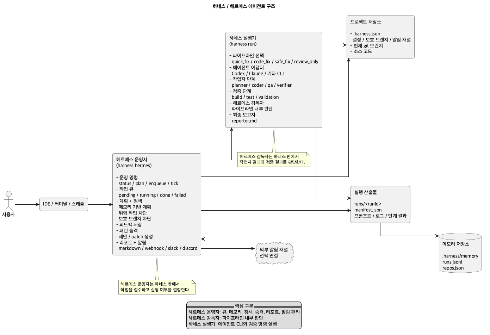

# Multi Agent Harness

여러 CLI 에이전트를 같은 파이프라인 계약으로 실행하기 위한 오케스트레이션 하네스입니다.

> **주의:** 이 프로젝트는 실험적인 local-first 하네스입니다. 대상 repo의 `.harness.json`, agent command, validation command를 신뢰할 수 있을 때만 실행하세요. 기본값은 로컬 머신의 child process와 shell command 실행이며, 선택적으로 Docker runner를 사용할 수 있습니다. `runs/` 산출물에는 prompt, stdout/stderr, 절대경로, secret 후보가 남을 수 있습니다.

이 프로젝트는 Codex 전용 wrapper가 아닙니다. 하네스가 요청, 역할별 프롬프트, 에이전트 실행, 검증, Hermes 감독, 최종 보고, 로그/manifest 기록을 관리하고, 실제 추론과 수정 작업은 선택한 CLI 에이전트가 수행합니다.

## 현재 지원 기능

- Codex, Claude, Antigravity, 커스텀 CLI를 같은 provider adapter 계약으로 실행합니다.
- `auto`, `quick_fix`, `code_fix`, `safe_fix`, `review_only` 파이프라인 선택을 제공합니다.
- `direct`, `worktree`, `patch` workspace mode로 원본 repo 반영 방식을 선택합니다.
- 기본 `local` runner와 선택형 `docker` runner를 지원합니다.
- `.harness.json`을 실행 전에 검증하고, `harness doctor`로 provider/runtime/validation 상태를 확인합니다.
- middleware runtime이 redaction, context budget, retry/fallback, tool lifecycle, run budget을 manifest에 기록합니다.
- Hermes supervisor가 validation 결과를 읽고 재검증, 재실행, safe pipeline 승격, 사람 검토 요청을 결정합니다.
- Hermes operator가 queue, approval, memory, feedback, promotion, report를 관리합니다.
- `harness show`와 `harness watch`로 manifest를 사람이 읽기 좋게 확인합니다.
- `harness metrics`로 전체 run을 집계해 복구율, 재실행률, human-review율, provider별 성공률, 평균 소요 시간을 확인합니다.
- `harness clean`과 `harness clean --worktrees`로 오래된 run/worktree 산출물을 정리합니다.
- 모든 run은 `runs/<runId>/manifest.json`, prompt, stdout/stderr, 최종 markdown report를 남깁니다.

## 핵심 개념

- **Agent adapter**: `codex`, `claude`, `antigravity`, 커스텀 CLI를 같은 실행 인터페이스로 감쌉니다.
- **Pipeline**: 요청 성격에 따라 planner, coder, qa, verifier, hermes, reporter 같은 역할을 순서대로 실행합니다.
- **Validation**: 대상 프로젝트의 `.harness.json`에 정의한 build/test/validation 명령을 하네스가 직접 실행합니다.
- **Hermes supervisor**: 작업자 결과와 검증 결과를 읽고 다음 행동을 결정하는 감독관 에이전트입니다.
- **Hermes operator**: task queue, memory, policy, feedback, promotion, report를 관리하는 top-level 운영 명령입니다.
- **Workspace mode**: 원본 repo 직접 실행, isolated worktree 실행, patch artifact 생성 중 선택합니다.
- **Runtime runner**: 로컬 child process 실행을 기본으로 두고, 필요한 경우 Docker 컨테이너 실행을 선택합니다.
- **Manifest**: run마다 요청, 설정, git 상태, 단계 결과, Hermes 결정, cleanup 결과를 `runs/<runId>/manifest.json`에 남깁니다.
- **Runs archive**: prompt, stdout/stderr 로그, 최종 markdown 산출물을 `runs/` 아래에 보관합니다.

## 빠른 시작

하네스 설치부터 대상 프로젝트 온보딩까지의 기본 흐름은 아래 5단계입니다.

1. 하네스 저장소를 받습니다.
2. 하네스 저장소로 이동합니다.
3. 전역 `harness` 명령을 연결합니다.
4. CLI 연결을 확인합니다.
5. 대상 프로젝트에서 온보딩을 시작합니다.

```sh
git clone <harness-repo-url> ~/.harness
cd ~/.harness
npm link
harness --help
cd /path/to/project
harness init-project
```

`npm link`는 `package.json`의 `bin.harness` 설정을 사용해 전역 `harness` 명령을 현재 checkout의 `bin/harness`에 연결합니다. clone만으로는 자동 등록되지 않으므로 새 환경에서는 한 번 실행해야 합니다.

일반 터미널에서 `harness init-project`를 실행하면 `.harness.json`을 만들거나 확인한 뒤 온보딩 질문을 이어갑니다. `init-project`는 빈 템플릿만 쓰지 않고, 현재 프로젝트에서 가능한 값을 자동으로 채웁니다.

- `package.json`의 `scripts.build` -> `buildCommand`
- `package.json`의 `scripts.test` -> `testCommand`
- `scripts.lint`, `scripts.typecheck`, `scripts.check` -> `validationCommands`
- lockfile -> `npm`, `pnpm`, `yarn`, `bun` 명령 선택
- git 브랜치 -> `protectedBranches`

감지하지 못한 값은 비워두고, 실행 결과에 `(not detected)`로 표시합니다. 그 경우 프로젝트의 실제 검증 명령을 확인해서 `.harness.json`에 직접 추가합니다.

스크립트나 CI처럼 질문 없이 실행해야 할 때는 옵션으로 명시합니다.

```sh
harness init-project --repo /path/to/project --refresh
harness init-project --repo /path/to/project --refresh --apply
harness init-project --repo /path/to/project --agent-routing 1,4
```

`--interactive`는 파이프나 자동화 환경에서도 온보딩 질문을 강제로 띄우고 싶을 때만 사용합니다.

대화형 질문의 대문자는 기본값을 뜻합니다. `[y/N]`에서 Enter는 `n`이고, `[Y/n]`에서 Enter는 `y`입니다. 하네스는 파괴적이거나 되돌리기 어려운 질문은 `N`을 기본값으로 두고, 온보딩 추천값은 `Y`를 기본값으로 둡니다. 라우팅 대상 질문의 `[1]`도 같은 의미로, Enter만 누르면 `1`번 Codex가 선택됩니다.

하네스를 실행합니다.

```sh
node ./bin/harness run --repo /path/to/project --pipeline auto --agent codex "작업 요청"
```

전역 CLI로 연결했다면 `harness` 명령을 바로 사용할 수 있습니다.

실제 에이전트를 실행하지 않고 prompt와 manifest 생성만 확인하려면 `--dry-run`을 붙입니다.

```sh
node ./bin/harness run --repo . --pipeline safe_fix --dry-run "Hermes 동작 확인"
```

Hermes를 top-level 운영자로 사용할 수도 있습니다.

```sh
harness hermes enqueue --repo . --pipeline quick_fix "작업 요청"
harness hermes tick
harness hermes report
```

설계와 진행 이력은 [docs/Hermes Autonomous Operations Roadmap](docs/hermes-autonomy-roadmap.md)에 정리되어 있습니다.

보안 모델과 신뢰 경계는 [docs/Security Model](docs/security-model.md)에 정리되어 있습니다.

## 구조도



이 구조도는 하네스 밖에서 작업을 접수하고 실행 여부를 결정하는 **Hermes operator**와, 파이프라인 내부에서 작업자 결과와 검증 결과를 판단하는 **Hermes supervisor**를 구분해서 보여줍니다. 원본 PlantUML 파일은 [docs/diagrams/hermes-harness-architecture.puml](docs/diagrams/hermes-harness-architecture.puml)에 있습니다.

## 명령어

```sh
harness run --repo <path> [options] "<request>"
harness doctor [--repo <path>] [--agent <provider>]
harness show [--latest|<runId>] [--json]
harness hermes <subcommand> [options] [request]
harness eval [--repo <path>] [--json]
harness init-project [--repo <path>] [--refresh] [--interactive] [--apply] [--agent-provider <provider>] [--agent-routing <targets>]
harness install-ide-task --repo <path>
harness watch [--interval <ms>] [--once] [--include-existing]
harness metrics [--json]
harness clean [--days <n>] [--keep <n>] [--dry-run] [--worktrees]
```

주요 `run` 옵션:

- `--pipeline <name>`: `auto`, `quick_fix`, `code_fix`, `safe_fix`, `review_only` 중 선택합니다.
- `--agent <provider>`: `codex`, `claude`, `antigravity`, 커스텀 provider를 선택합니다.
- `--workspace-mode <mode>`: `direct`, `worktree`, `patch` 중 선택합니다.
- `--runner <mode>`: `local`, `docker` 중 선택합니다.
- `--runner-image <image>`: Docker runner가 사용할 이미지를 지정합니다.
- `--dry-run`: agent를 실행하지 않고 prompt와 manifest 생성을 확인합니다.
- `--policy-approved`: direct run policy gate를 명시적으로 승인합니다.

주요 `init-project` 옵션:

- `--agent-provider <provider>`: `.harness.json`의 기본 worker provider를 `codex`, `claude`, `antigravity` 중 하나로 설정합니다.
- `--agent-routing <targets>`: IDE/CLI 에이전트가 하네스를 호출하도록 라우팅 파일을 설치합니다.

- `run`: 파이프라인을 실행합니다.
- `doctor`: 에이전트 CLI 연결 상태를 확인합니다.
- `show`: `runs/<runId>/manifest.json`을 사람이 읽기 좋은 요약 또는 JSON summary로 보여줍니다.
- `hermes`: Hermes top-level 운영 명령을 실행합니다.
- `eval`: 대상 repo의 `.harness.json`과 선택적 `.harness-eval.json`을 기준으로 하네스 준비도와 fixture 기대값을 점검하고 `.harness/eval/`에 결과를 남깁니다.
- `init-project`: 대상 프로젝트를 읽어 `.harness.json` 기본 파일을 만들고 package scripts/git branch를 가능한 범위에서 자동 반영합니다.
- `install-ide-task`: 대상 프로젝트의 `.vscode/tasks.json`에 `Harness: Run` 작업을 추가합니다.
- `watch`: `runs/`의 manifest 변화를 관찰하며 run, step, validation, Hermes decision, 완료 상태를 터미널에 표시합니다.
- `metrics`: `runs/`의 모든 manifest를 읽어 복구율, 재실행률, human-review율, provider별 성공률, 평균 소요 시간을 집계합니다. `--json`으로 기계 판독용 출력을 냅니다.
- `clean`: 오래된 `runs/` 디렉터리를 `runs/.trash/`로 이동하거나, `--worktrees`로 isolated worktree를 정리합니다.

## 파이프라인

파이프라인은 [config/pipelines.json](config/pipelines.json)에 정의되어 있습니다.

| Pipeline | 흐름 | 용도 |
| --- | --- | --- |
| `quick_fix` | coder -> validation -> hermes -> reporter | 작고 명확한 수정 |
| `code_fix` | planner -> coder -> validation -> qa -> hermes -> reporter | 일반적인 코드 변경 |
| `safe_fix` | planner -> coder -> validation -> qa -> verifier -> hermes -> reporter | 위험하거나 중요한 변경 |
| `review_only` | reviewer -> verifier -> hermes -> reporter | 파일 수정 없는 리뷰 |

`pipeline: "auto"`는 deterministic classifier로 요청을 분류합니다. 작은 문서/설정 수정은 `quick_fix`, 복잡한 런타임/정책/구현 작업은 `code_fix`, 인증/결제/삭제/마이그레이션 같은 위험 신호는 `safe_fix`, 리뷰 요청은 `review_only`로 보냅니다. 명시적인 `--pipeline <name>`이 있으면 그 값이 항상 우선합니다.

### Workspace Mode

기본 실행 모드는 `direct`입니다. 이 모드는 기존처럼 대상 repo에서 agent와 validation을 직접 실행합니다.

```sh
harness run --repo . --workspace-mode direct "작업 요청"
```

원본 working tree를 바로 건드리고 싶지 않으면 `worktree` 또는 `patch`를 사용할 수 있습니다.

```sh
harness run --repo . --workspace-mode worktree "작업 요청"
harness run --repo . --workspace-mode patch "작업 요청"
```

- `direct`: 대상 repo에서 직접 실행합니다.
- `worktree`: `runs/<runId>/worktree`에 git worktree를 만들고 그 안에서 실행합니다. 변경 결과는 worktree에 남습니다.
- `patch`: 임시 worktree에서 실행한 뒤 `runs/<runId>/changes.patch`를 만들고 worktree를 제거합니다.

`worktree`와 `patch` 모드는 git repo와 유효한 `HEAD` commit이 필요합니다. 원본 repo의 uncommitted 변경은 isolated workspace에 자동 반영되지 않습니다.

`patch` 모드는 run 종료 시 worktree를 제거하고 patch artifact만 남깁니다. `worktree` 모드는 사람이 산출물을 확인할 수 있도록 worktree를 남깁니다. 오래된 worktree 산출물은 아래처럼 정리할 수 있습니다.

```sh
harness clean --worktrees --days 7 --keep 5
harness clean --worktrees --days 7 --keep 5 --dry-run
```

### Runtime Runner

기본 runner는 `local`입니다. 즉 agent CLI와 validation command는 현재 머신의 child process로 실행됩니다.

```sh
harness run --repo . --runner local "작업 요청"
```

강한 격리가 필요한 경우에만 Docker runner를 선택할 수 있습니다.

```sh
harness run --repo . --runner docker --runner-image node:22 "작업 요청"
```

`.harness.json`에도 설정할 수 있습니다.

```json
{
  "runner": {
    "mode": "docker",
    "image": "node:22",
    "network": "none",
    "envAllowlist": ["ANTHROPIC_API_KEY", "OPENAI_API_KEY"]
  }
}
```

- `local`: 기존 실행 모델입니다. 별도 Docker가 필요 없습니다.
- `docker`: agent와 validation command를 `docker run --rm`으로 실행합니다.
- Docker runner는 실행 repo와 run 디렉터리를 같은 절대경로로 bind mount합니다.
- Docker 이미지 안에는 선택한 agent CLI와 validation에 필요한 런타임이 설치되어 있어야 합니다.
- 인증 값은 자동으로 모두 넘기지 않습니다. 필요한 환경변수만 `envAllowlist`에 명시합니다.
- `network`는 `default`, `none`, `host` 중 하나입니다.

## Hermes Supervisor

`hermes`는 작업자 에이전트를 감시하고 다음 흐름을 결정하는 감독관입니다. 단순 요약자가 아니라 하네스가 읽을 수 있는 decision JSON을 출력하고, 하네스는 그 결정을 실제 실행 흐름에 반영합니다.

Hermes가 사용할 수 있는 액션은 다음과 같습니다.

- `continue`: 최종 보고 단계로 진행합니다.
- `run_validation`: 설정된 validation 명령만 다시 실행한 뒤 Hermes 판단으로 돌아갑니다.
- `escalate_to_safe_fix`: 현재 파이프라인을 `safe_fix`로 승격하고 더 강한 흐름을 다시 실행합니다.
- `rerun_step`: 이전 worker 하나를 제한된 횟수 안에서 다시 실행합니다.
- `stop_failed`: reporter가 실패 상태를 보고하게 한 뒤 하네스 실행을 실패로 종료합니다.
- `request_human_review`: reporter가 사람 검토 필요 상태를 보고하게 한 뒤 하네스 실행을 실패로 종료합니다.

Hermes 결정은 `manifest.json`의 `supervisorDecisions`에 기록됩니다. 파이프라인 승격은 `pipelineChanges`에 기록됩니다.

Hermes 출력의 마지막에는 아래 형식의 fenced JSON block이 있어야 합니다.

```json
{
  "status": "success",
  "nextAction": "continue",
  "targetStep": null,
  "reason": "Validation passed and no blocking risks remain.",
  "instructions": "Report the changed files and validation result."
}
```

하네스는 decision schema를 검증합니다. 파싱할 수 없거나 지원하지 않는 액션이면 `request_human_review`로 처리하고 manifest에 schema 오류를 남깁니다.

## Hermes Command Layer

Hermes를 pipeline 내부 supervisor step이 아니라 top-level 운영 명령으로도 사용할 수 있습니다.

```sh
harness hermes status
harness hermes plan "인증 로직을 안전하게 수정해줘"
harness hermes enqueue --repo . --pipeline quick_fix "작업 요청"
harness hermes queue
harness hermes approve --task <taskId> "검토 후 승인"
harness hermes reject --task <taskId> "실행하지 않음"
harness hermes tick
harness hermes memory rebuild
harness hermes memory search "인증"
harness hermes feedback --run <runId> --rating good "요약과 검증이 좋았음"
harness hermes promote --dry-run
harness hermes promote --apply
harness hermes report
```

- `status`: 최근 `runs/` manifest를 읽어 성공/실패 상태, Hermes decision, validation 실패, cleanup 상태를 요약합니다.
- `plan`: 요청을 실행하지 않고 rule-based preflight로 pipeline과 agent 전략을 추천합니다.
- `enqueue`: 파일 기반 task queue에 작업을 추가합니다.
- `queue`: pending/running/done/failed task 상태를 요약합니다.
- `approve`: approval pending task를 승인하고 다시 pending으로 이동합니다.
- `reject`: approval pending task를 rejected로 이동합니다.
- `tick`: pending task 하나를 꺼내 `harness run`으로 실행하고 done/failed로 이동합니다. 사람 승인이 필요한 task는 실행하지 않고 approval pending으로 이동합니다.
- `memory rebuild`: `runs/` manifest를 `.harness/memory/runs.jsonl`과 repo 요약으로 재생성합니다.
- `memory search`: memory index에서 요청, repo, pipeline, status, Hermes action 기준으로 검색합니다.
- `feedback`: 특정 run에 대한 사용자 평가를 저장하고 memory rebuild 시 plan 근거에 반영합니다.
- `promote`: 반복되는 safe_fix 승격, validation 실패, bad feedback을 설정/policy/prompt 개선 후보로 승격합니다. `--dry-run`은 제안만 출력하고, `--apply`는 promotion 기록과 `.harness.json` 후보 변경을 담은 patch artifact를 `.harness/promotions/`에 남깁니다.
- `report`: 현재 Hermes 운영 상태를 terminal에 요약하고 markdown 리포트를 `.harness/reports/`에 남깁니다.

`plan`은 사람이 읽을 수 있는 요약과 함께 machine-readable JSON을 출력합니다. memory index가 있고 `--repo`를 함께 넘기면 과거 run과 repo profile을 근거로 추천을 보강합니다.

```sh
harness hermes memory rebuild
harness hermes plan --repo /path/to/project "인증 로직을 안전하게 수정해줘"
```

task queue는 하네스 루트의 `.harness/queue/` 아래에 저장됩니다. 이 디렉터리는 로컬 운영 상태이므로 커밋 대상이 아닙니다.
승인이 필요한 task는 `.harness/queue/approval_pending/`에 보관됩니다. `approve`하면 다시 pending으로 이동하고, `reject`하면 `.harness/queue/rejected/`로 이동합니다.
memory index는 하네스 루트의 `.harness/memory/` 아래에 저장됩니다. `runs/`를 원자료로 다시 만들 수 있는 파생 데이터입니다.
feedback은 하네스 루트의 `.harness/feedback/` 아래에 저장됩니다. `bad` feedback이 있는 유사 run은 이후 plan에서 caution evidence로 표시됩니다.
promotion 기록은 하네스 루트의 `.harness/promotions/` 아래에 저장됩니다. `--apply`도 프로젝트 설정과 prompt를 직접 수정하지 않고, 대상 repo에서 검토 후 적용할 수 있는 `.harness.json` 후보 diff와 promotion marker 파일 diff를 `.patch`로 함께 남깁니다.
report artifact는 하네스 루트의 `.harness/reports/` 아래에 저장됩니다. `hermes tick`은 idle, done, failed 결과마다 tick report를 자동으로 남깁니다.
외부 알림은 `hermes.notifications.channels`에 adapter를 설정하면 `tick` 결과와 report path를 전송합니다. env key가 없으면 실패하지 않고 skipped로 기록됩니다.

## Run Viewer

실행 후 manifest JSON을 직접 열지 않고 요약을 볼 수 있습니다.

```sh
harness show --latest
harness show <runId>
harness show --json <runId>
```

요약에는 run 상태, repo, pipeline selection, workspace mode, patch path, policy/protected branch decision, runtime contract, retry/fallback, redaction/context truncation, provider usage summary, prompt cache, step 상태, validation 실패, Hermes decision, reporter summary, 주요 artifact 경로가 포함됩니다.

## 프로젝트 설정

대상 프로젝트 루트에 `.harness.json`을 둘 수 있습니다.

어떤 필드를 왜 채워야 할지 모르겠다면 먼저 [Project Config Guide](docs/project-config-guide.md)를 봅니다. 필드 형식만 빠르게 확인하려면 [Project Config Schema](docs/config-schema.md)를 봅니다.

```json
{
  "pipeline": "auto",
  "pipelineSelection": {
    "mode": "deterministic",
    "defaultPipeline": "quick_fix"
  },
  "agent": {
    "provider": "codex"
  },
  "workspaceMode": "worktree",
  "buildCommand": "npm run build",
  "testCommand": "npm test",
  "validationCommands": [
    {
      "id": "check",
      "command": "npm run check"
    }
  ],
  "redaction": {
    "enabled": true,
    "mode": "mask"
  },
  "context": {
    "maxPreviousOutputBytes": 262144,
    "maxStepOutputBytes": 65536,
    "summarizer": {
      "enabled": true,
      "mode": "deterministic"
    }
  },
  "retry": {
    "agentRetries": 1,
    "validationRetries": 1,
    "backoffMs": 1000,
    "retryOnExitCodes": [124],
    "retryOnStderrPatterns": ["rate limit", "timeout"]
  },
  "budget": {
    "maxAgentSteps": 8,
    "maxProviderCalls": 8,
    "maxValidationCommands": 12,
    "maxRuntimeMs": 900000
  },
  "supervisor": {
    "enabled": true,
    "maxSupervisorTurns": 2,
    "maxStepRetries": 0
  },
  "cleanup": {
    "enabled": false,
    "days": 7,
    "keep": 20
  },
  "runner": {
    "mode": "local"
  },
  "protectedBranches": ["main", "production"]
}
```

CLI 옵션이 `.harness.json`보다 우선합니다.

```sh
node ./bin/harness run --repo /path/to/project --agent claude "작업 요청"
```

이 하네스 repo 자체를 하네스로 수정할 때는 `workspaceMode: "worktree"` 또는 `patch`를 권장합니다. 현재 branch가 `main` 같은 protected branch일 때 `workspaceMode: "direct"`로 쓰기 실행하면 direct run policy gate가 차단합니다.

### Eval Spec

fixture repo에는 선택적으로 `.harness-eval.json`을 둘 수 있습니다. 이 파일은 `harness eval`이 단순 준비도 점검을 넘어서 기대 score, 개별 check status, 그리고 하네스의 **판단 품질**(정책·파이프라인 선택·supervisor 결정)을 골든 시나리오 회귀로 검증하게 합니다.

```json
{
  "expected": {
    "status": "passed",
    "minScore": 1,
    "checks": {
      "project-config-schema": "pass",
      "validation-coverage": "pass"
    }
  },
  "policyCases": [
    {
      "id": "destructive-delete",
      "request": "데이터베이스 전체 삭제를 실행해줘",
      "mode": "direct",
      "expected": {
        "allowed": false,
        "requiresApproval": true
      }
    }
  ],
  "pipelineCases": [
    {
      "id": "review-only",
      "request": "이번 변경을 리뷰만 해줘",
      "expected": { "selected": "review_only" }
    }
  ],
  "supervisorCases": [
    {
      "id": "unparseable-collapses-to-human-review",
      "output": "모델이 결정 블록을 내지 않음",
      "expected": { "valid": false, "nextAction": "request_human_review" }
    }
  ]
}
```

- `policyCases` — 요청에 대한 정책 판정(`allowed`/`requiresApproval`)을 골든으로 고정.
- `pipelineCases` — 파이프라인 자동 선택 결과(`selected`/`mode`, `minComplexity`/`minRisk`)를 고정. `requestedPipeline`으로 명시 선택도 검증.
- `supervisorCases` — supervisor 결정 파싱(`parseSupervisorDecision`)을 고정. 파싱 불가·무효 입력이 항상 `request_human_review`로 안전 붕괴하는지 회귀로 검증.

정책·파이프라인·supervisor 케이스는 eval을 "돌아갈 준비가 됐나"에서 "판단이 여전히 옳은가"로 확장합니다. 골든이 회귀하면 eval status가 `failed`가 되고 recommendation에 해당 케이스 id가 노출됩니다.

### Init Project 자동 감지

`harness init-project`는 사용자가 처음부터 모든 명령을 알 필요가 없도록 현재 프로젝트를 읽어서 기본 설정을 채웁니다. 다른 경로를 대상으로 할 때만 `--repo <path>`를 붙입니다.

이미 `.harness.json`이 있으면 기본적으로 덮어쓰지 않습니다. 대신 아래처럼 refresh 모드로 부족한 설정을 제안받을 수 있습니다.

```sh
harness init-project --repo . --refresh
```

예시 출력:

```text
Suggested .harness.json updates:
+ buildCommand: npm run build
+ testCommand: npm run test
+ validationCommands.lint: npm run lint
~ protectedBranches: dev, production -> main, production
Run with --refresh --apply to update .harness.json.
```

실제 파일을 수정하려면 명시적으로 `--apply`를 붙입니다.

```sh
harness init-project --repo . --refresh --apply
```

일반 터미널에서는 `harness init-project`만 실행해도 온보딩 질문이 이어집니다.

```sh
harness init-project
```

파이프나 자동화 환경에서도 질문을 강제로 띄우고 싶을 때만 `--interactive`를 붙입니다.

```sh
harness init-project --interactive
```

새 프로젝트처럼 `.harness.json`이 없을 때도 파일 생성 후 온보딩 질문이 이어집니다. 이미 `.harness.json`이 있을 때는 아래 다섯 가지 질문이 순서대로 나옵니다.

첫 번째 질문은 기존 설정을 전체 리셋할지 묻습니다.

```text
Existing .harness.json found. Reset it from scratch? [y/N]
```

- `y`: 기존 설정을 코어 기본값으로 전체 재설정합니다. 기존 커스텀 필드는 사라질 수 있습니다.
- `n` 또는 Enter: 기존 설정을 유지합니다.

두 번째 질문은 기본 추천 필드를 추가할지 묻습니다. 첫 번째 질문에서 리셋을 선택했다면 새로 재설정되는 파일에 적용되고, 리셋하지 않았다면 기존 파일에 병합됩니다.

```text
Add recommended default fields to .harness.json? [Y/n]
```

- `y`: 누락된 `buildCommand`, `testCommand`, `validationCommands`, `supervisor`, `cleanup`, `runner`, `protectedBranches` 추천값을 병합합니다.
- `n`: 리셋한 경우 코어 기본값만 남기고, 리셋하지 않은 경우 기존 필드를 그대로 둡니다.
- Enter: 기본값 `y`로 처리합니다.

세 번째 질문은 앞으로 하네스가 작업 중 필요하다고 판단한 설정을 사용자에게 제안해도 되는지 저장합니다.

```text
Allow the harness to ask before adding helpful config during future work? [Y/n]
```

- `y`: `.harness.json`에 `configSuggestions.enabled: true`, `mode: "ask"`를 저장합니다.
- `n`: `configSuggestions.enabled: false`를 저장합니다.
- Enter: 기본값 `y`로 처리합니다.

네 번째 질문은 IDE/CLI 에이전트가 명시적인 하네스 요청을 받았을 때 직접 수정하지 않고 하네스를 실행하도록 라우팅 파일을 설치할지 묻습니다.

```text
Install harness routing rules for coding agents? [Y/n]
```

- `y`: 이어서 어떤 coding agent용 라우팅 파일을 설치할지 번호로 선택합니다.
- `n`: 새 라우팅 파일을 만들지 않고, 하네스가 이전에 만든 라우팅 블록이 있으면 제거합니다. 마커 밖에 사용자가 직접 쓴 문서는 유지합니다.
- Enter: 기본값 `y`로 처리합니다.

네 번째 질문에서 `y` 또는 Enter를 입력한 경우에만 라우팅 대상 선택 질문이 이어집니다.

```text
Select routing targets:
  1. Codex (AGENTS.md)
  2. Claude Code (CLAUDE.md)
  3. Gemini / Antigravity (GEMINI.md + AGENTS.md)
  4. Cursor (.cursor/rules/harness-routing.mdc)
Enter numbers separated by comma [1]:
```

예를 들어 Codex와 Cursor를 같이 쓰면 `1,4`를 입력합니다. Enter만 누르면 기본값으로 `1`만 적용합니다. Claude, Cursor, Gemini, Antigravity까지 한 번에 설정하려면 비대화형 옵션 `--agent-routing all`을 사용할 수도 있습니다.

다섯 번째이자 마지막 질문은 하네스 내부 worker provider를 무엇으로 둘지 묻습니다. 상위 도구의 라우팅 파일과 별개로 `.harness.json`의 `agent.provider`에 저장됩니다.

```text
Select default worker provider:
  1. Codex
  2. Claude Code
  3. Antigravity
Enter number or provider name [codex]:
```

### Agent Routing 자동 설치

`.harness.json`은 하네스 실행 설정이고, `AGENTS.md`/`CLAUDE.md`/`GEMINI.md`/Cursor rules는 IDE나 CLI 에이전트가 “언제 하네스를 태울지” 판단하는 라우팅 규칙입니다. `init-project`에서 함께 설치할 수 있습니다.

```sh
harness init-project --repo . --agent-routing codex
harness init-project --repo . --agent-provider claude
harness init-project --repo . --agent-routing 1,4
harness init-project --repo . --agent-routing codex,claude,cursor,gemini,antigravity
harness init-project --repo . --agent-routing all
```

`--agent-provider`는 하네스 내부 worker provider를 정하고, `--agent-routing`은 Codex/Claude Code/Cursor 같은 상위 도구가 하네스를 호출하도록 안내 파일을 설치합니다. 두 설정은 별개입니다.

대상 파일:

| Target | 파일 |
| --- | --- |
| `codex` | `AGENTS.md` |
| `antigravity` | `AGENTS.md` |
| `claude` | `CLAUDE.md` |
| `gemini` | `GEMINI.md` |
| `cursor` | `.cursor/rules/harness-routing.mdc` |

이미 라우팅 블록이 있으면 기본적으로 그대로 둡니다. 하네스가 관리하는 블록은 아래 마커 사이에만 들어갑니다.

```md
<!-- harness-routing:start -->
...
<!-- harness-routing:end -->
```

사용자가 수정한 라우팅 블록을 기본값으로 되돌리려면 `--reset-agent-routing`을 붙입니다.

```sh
harness init-project --repo . --agent-routing all --reset-agent-routing
```

하네스 라우팅만 빼고 싶으면 `--remove-agent-routing`을 사용합니다. 마커 밖의 기존 문서는 유지합니다.

```sh
harness init-project --repo . --agent-routing all --remove-agent-routing
```

`--install-agent-routing`은 `--agent-routing codex`의 짧은 별칭입니다.

Node 계열 프로젝트에서는 lockfile로 package manager를 고릅니다.

- `pnpm-lock.yaml` -> `pnpm`
- `yarn.lock` -> `yarn`
- `bun.lock`, `bun.lockb` -> `bun`
- 그 외 -> `npm`

그리고 `package.json` scripts를 아래처럼 매핑합니다.

| package script | `.harness.json` 필드 |
| --- | --- |
| `build` | `buildCommand` |
| `test` | `testCommand` |
| `lint` | `validationCommands[]` |
| `typecheck` | `validationCommands[]` |
| `check` | `validationCommands[]` |

예를 들어 `package.json`에 아래 scripts가 있으면:

```json
{
  "scripts": {
    "build": "vite build",
    "test": "vitest run",
    "lint": "eslint .",
    "typecheck": "tsc --noEmit"
  }
}
```

`pnpm-lock.yaml`이 있는 repo에서는 이렇게 생성됩니다.

```json
{
  "buildCommand": "pnpm run build",
  "testCommand": "pnpm run test",
  "validationCommands": [
    {
      "id": "lint",
      "command": "pnpm run lint"
    },
    {
      "id": "typecheck",
      "command": "pnpm run typecheck"
    }
  ]
}
```

브랜치는 현재 작업 브랜치보다 `main`, `master` 같은 보호 후보 브랜치 존재 여부를 먼저 봅니다. 예를 들어 현재 브랜치가 `dev`여도 repo에 `main` 브랜치가 있으면 기본값은 `main`, `production`이 됩니다. 보호 후보를 찾지 못한 경우에만 remote default branch나 현재 브랜치를 fallback으로 사용합니다.

감지되지 않는 프로젝트도 있습니다. Go, Rust, Maven, Gradle, Makefile 기반 프로젝트는 현재 자동 감지 대상이 아니므로 생성 후 아래처럼 직접 채웁니다.

```json
{
  "buildCommand": "cargo build",
  "testCommand": "cargo test",
  "validationCommands": [
    {
      "id": "fmt",
      "command": "cargo fmt --check"
    }
  ]
}
```

설정 후에는 아래 명령으로 연결 상태, config validation, runtime, validation command, trust boundary, eval readiness를 확인합니다.

```sh
harness doctor --repo /path/to/project --agent codex
```

`harness eval --repo <path>`는 `.harness.json` 준비도와 선택적 `.harness-eval.json` fixture 기대값을 점검합니다. 결과에는 score와 recommendations가 포함되며, JSON report는 `.harness/eval/`에 저장됩니다.

### Validation 설정

`buildCommand`, `testCommand`, `validationCommands`는 validation 단계에서 사용됩니다. 실행 순서는 다음과 같습니다.

1. `buildCommand`
2. `testCommand`
3. `validationCommands`

예시:

```json
{
  "buildCommand": "npm run build",
  "testCommand": "npm test",
  "validationCommands": [
    "npm run lint",
    {
      "id": "typecheck",
      "command": "npm run typecheck"
    }
  ]
}
```

validation 명령이 하나도 없으면 manifest에 `skipped`로 기록됩니다.

### Resource Control 설정

agent step과 validation command에는 기본 timeout과 log size 제한이 적용됩니다.

기본값:

- `agentTimeoutMs`: `600000`
- `validationTimeoutMs`: `300000`
- `maxLogBytes`: `1048576`

프로젝트별로 조정하려면 `.harness.json`에 `resources`를 둡니다.

```json
{
  "resources": {
    "agentTimeoutMs": 600000,
    "validationTimeoutMs": 300000,
    "maxLogBytes": 1048576
  }
}
```

개별 validation command에도 timeout/log 제한을 줄 수 있습니다.

```json
{
  "validationCommands": [
    {
      "id": "typecheck",
      "command": "npm run typecheck",
      "timeoutMs": 120000,
      "maxLogBytes": 524288
    }
  ]
}
```

각 step은 `timeoutMs`, `maxLogBytes`, `stdoutTruncated`, `stderrTruncated`, `lastOutputAt`을 manifest에 남깁니다. timeout이 발생하면 해당 step은 `exitCode: 124`, `timedOut: true`로 기록됩니다. 실행 중 `SIGINT` 또는 `SIGTERM`을 받으면 현재 child process를 종료하고 `exitCode: 130`, `cancelled: true`로 기록합니다.

### Middleware Runtime 설정

agent/validation/tool 실행 주변에는 가벼운 middleware runtime이 붙습니다. 이 계층은 prompt/output redaction, context 크기 제한, retry/fallback, tool setup/teardown, run budget을 처리하고 결과를 `manifest.middleware`와 `manifest.tools.lifecycle`에 남깁니다.

```json
{
  "redaction": {
    "enabled": true,
    "mode": "mask"
  },
  "context": {
    "maxPreviousOutputBytes": 262144,
    "maxStepOutputBytes": 65536,
    "summarizer": {
      "enabled": true,
      "mode": "deterministic"
    }
  },
  "retry": {
    "agentRetries": 1,
    "validationRetries": 1,
    "backoffMs": 1000,
    "retryOnExitCodes": [124],
    "retryOnStderrPatterns": ["rate limit", "timeout"],
    "fallbackAgents": [
      {
        "provider": "claude"
      }
    ]
  },
  "budget": {
    "maxAgentSteps": 20,
    "maxProviderCalls": 20,
    "maxValidationCommands": 30,
    "maxRuntimeMs": 1800000
  },
  "tools": [
    {
      "id": "browser",
      "setupCommand": "npm run browser:start",
      "teardownCommand": "npm run browser:stop",
      "envAllowlist": ["BROWSER_TOKEN"]
    }
  ]
}
```

재시도는 모든 실패에 적용하지 않고 timeout, rate limit, 일시적 provider 오류처럼 retryable로 분류된 실패에만 적용됩니다. provider 로그에서 token/cost usage를 읽을 수 있으면 provider adapter를 통해 manifest에 기록하고, 읽을 수 없으면 `unknown`으로 남깁니다.

`pipeline: "auto"`의 선택 자체는 LLM을 호출하지 않는 deterministic classifier입니다. 선택 결과와 판단 신호는 `manifest.pipelineSelection`에 기록됩니다. provider 호출 수, 파싱된 token/cost 사용량, 남은 provider call 예산은 `manifest.usageSummary`와 `harness show`에 표시됩니다. provider가 전체 token budget을 노출하지 않으면 남은 token 수는 추정하지 않고 `unknown`으로 남깁니다.

각 run은 `prompt-cache.json`도 생성합니다. 이 artifact는 prompt template hash, static project config hash, validation command hash를 담으며, 이후 prompt/context cache 최적화나 회귀 비교에 사용할 수 있습니다.

manifest의 `runtime.contract`에는 local/Docker runner의 격리 수준, env 전달 정책, mount/network 정보가 기록됩니다.

정확한 필드 형식은 [Project Config Schema](docs/config-schema.md)를 봅니다.

### Protected Branch 설정

Hermes `tick`은 task를 실행하기 직전에 대상 repo의 현재 git branch를 확인합니다. 현재 branch가 `protectedBranches`에 포함되면 자동 실행하지 않고 approval pending으로 이동하며 사람 검토가 필요하다고 보고합니다.

```json
{
  "protectedBranches": ["main", "production"]
}
```

설정이 없으면 기본값으로 `main`, `production`을 보호 브랜치로 봅니다. git branch를 확인할 수 없는 repo에서는 이 정책만으로 실행을 막지 않습니다.

`harness run`도 같은 보호 브랜치 정보를 manifest에 기록합니다. protected branch에서 `workspaceMode: "direct"`로 쓰기 실행하려 하면 차단되며, 격리된 `worktree`/`patch` 모드나 명시적인 `--policy-approved`가 필요합니다.

### Policy Gate 설정

`harness run`은 실행 전에 요청을 가볍게 분류하고 policy decision을 manifest에 기록합니다. 기본값에서는 명백히 파괴적인 요청은 직접 실행을 막고, 인증/결제/마이그레이션 같은 고위험 요청은 기록하되 직접 실행은 막지 않습니다. 고위험 요청도 직접 실행 전에 차단하려면 아래처럼 설정합니다.

```json
{
  "policy": {
    "enforceApprovalForDirectRun": true,
    "allowDestructiveCommands": false,
    "requireApprovalFor": ["auth", "payment", "database migration"]
  }
}
```

Hermes queue 기반 자율 실행은 기존처럼 `requireApprovalFor`에 걸리는 요청을 사람 검토 대상으로 처리합니다.

### Notification 설정

Hermes는 기본적으로 terminal과 markdown report를 사용합니다. 외부 alert 채널은 `.harness.json`에 adapter 구조만 설정해두고, 실제 URL이나 토큰은 환경변수로 주입합니다.

```json
{
  "hermes": {
    "notifications": {
      "channels": [
        {
          "name": "harness-alerts",
          "type": "webhook",
          "urlEnv": "HERMES_ALERT_WEBHOOK_URL",
          "events": ["tick.failed"]
        },
        {
          "name": "team-slack",
          "type": "slack",
          "urlEnv": "HERMES_SLACK_WEBHOOK_URL",
          "events": ["tick.failed", "tick.done"]
        }
      ]
    }
  }
}
```

지원되는 초기 adapter type은 `webhook`, `slack`, `discord`입니다.

- `webhook`: Hermes event payload를 JSON으로 POST합니다.
- `slack`: Slack incoming webhook 형식으로 text를 보냅니다.
- `discord`: Discord webhook 형식으로 content를 보냅니다.

채널 env가 없거나 event가 구독 대상이 아니면 Hermes는 알림을 보내지 않고 `Notifications: skipped ...`로 보고합니다.

### Supervisor 설정

```json
{
  "supervisor": {
    "enabled": true,
    "maxSupervisorTurns": 3,
    "maxStepRetries": 1,
    "agent": {
      "provider": "codex"
    }
  }
}
```

- `enabled`: `false`면 `hermes` 단계를 건너뜁니다.
- `maxSupervisorTurns`: Hermes가 판단할 수 있는 최대 턴 수입니다.
- `maxStepRetries`: 같은 worker를 다시 실행할 수 있는 최대 횟수입니다.
- `agent`: Hermes 단계만 별도 provider/CLI로 실행합니다. 생략하면 기본 `agent`를 사용합니다.

역할별 agent가 더 필요하면 `agents.<stepId>`에 같은 형식의 설정을 둘 수 있습니다.

```json
{
  "agents": {
    "qa": {
      "provider": "claude"
    }
  }
}
```

### Cleanup 설정

자동 청소를 켜려면 `cleanup.enabled`를 `true`로 설정합니다.

```json
{
  "cleanup": {
    "enabled": true,
    "days": 7,
    "keep": 20
  }
}
```

자동 청소 훅은 하네스 run이 끝난 뒤 실행됩니다.

- 현재 run은 항상 제외합니다.
- `--dry-run`으로 실행한 경우 cleanup도 dry-run으로 수행합니다.
- cleanup 결과는 `manifest.json`의 `cleanup` 필드에 기록됩니다.
- cleanup 실패는 manifest에 남지만 이미 끝난 작업 결과를 덮어쓰지는 않습니다.

## 커스텀 에이전트

기본 provider 외의 CLI도 붙일 수 있습니다.

```json
{
  "agent": {
    "provider": "my-agent",
    "command": "my-agent",
    "versionArgs": ["--version"],
    "outputMode": "stdout",
    "args": ["run", "--repo", "{{repo}}", "--prompt-file", "{{promptPath}}"]
  }
}
```

`args`에서 사용할 수 있는 placeholder:

- `{{repo}}`
- `{{prompt}}`
- `{{promptPath}}`
- `{{finalPath}}`
- `{{stepId}}`

`outputMode`는 두 가지입니다.

- `stdout`: 에이전트 stdout을 단계 결과 markdown으로 저장합니다.
- `file`: 에이전트가 `{{finalPath}}` 또는 자체 옵션으로 결과 파일을 직접 쓰는 방식입니다.

provider 연결 정보는 `manifest.json`에 `outputMode`, `defaultTimeoutMs`, `capabilities`, `custom`으로 기록됩니다. `harness doctor`도 선택된 provider의 command, version, output mode, timeout, custom 여부를 보여줍니다.

현재 내장 provider의 기본 실행 형태:

- `codex`: `codex exec --cd <repo> --sandbox <mode> --json --output-last-message <file>`
- `claude`: `claude -p <prompt> --output-format text`
- `antigravity`: `antigravity run --prompt <prompt>`

CLI 버전이나 조직 정책에 따라 지원 옵션이 다를 수 있습니다. 실패하면 먼저 `harness doctor`와 해당 CLI의 `--help`를 확인합니다.

## Runs와 Manifest

각 실행은 `runs/<runId>/` 아래에 산출물을 남깁니다.

대표 파일:

- `request.txt`: 사용자 요청 원문
- `manifest.json`: 실행 설정, pipeline selection, usage summary, 단계 결과, git snapshot, Hermes 결정, cleanup 결과
- `<step>.prompt.md`: 각 step에 전달한 prompt
- `<step>.<agent>.stdout.log`: step stdout 로그
- `<step>.<agent>.stderr.log`: step stderr 로그
- `<step>.md`: step 최종 markdown 산출물

`manifest.json`에는 다음 정보가 포함됩니다.

- `runId`, `repo`, `request`, `pipeline`, `completedPipeline`
- `pipelineSelection`
- `workspace`, `executionRepo`
- agent provider, command, version
- `projectConfig`, `validationCommands`, `supervisor`
- 실행 전후 `git`, `gitAfter` snapshot
- `steps`
- `supervisorDecisions`
- `reporterSummary`
- `pipelineChanges`
- `cleanup`
- `usageSummary`
- 최종 `status`

기계가 읽는 산출물 계약은 [docs/Artifact Schema](docs/artifact-schema.md)에 정리되어 있습니다.

## Watch 모드

하네스 전용 터미널을 열어두고 다른 터미널이나 IDE에서 실행되는 하네스 run을 관찰하려면 `watch`를 사용합니다.

```sh
harness watch
```

로컬 개발 중에는 다음처럼 실행할 수 있습니다.

```sh
node ./bin/harness watch --interval 1000
```

표시되는 이벤트 예시:

```text
[run] 2026-06-30_215720_830 pipeline=safe_fix repo=/path/to/project
[step] planner succeeded agent=codex
[step] coder succeeded agent=codex
[validation] validation:test failed exit=1
[hermes] rerun_step status=incomplete target=coder reason="Validation failed."
[pipeline] code_fix -> safe_fix reason="Verifier coverage is needed."
[done] 2026-06-30_215720_830 status=succeeded
```

기본적으로 이미 끝난 과거 run은 처음에 쏟아내지 않고, 새 run과 진행 중인 run 변화를 보여줍니다. 과거 run까지 한 번에 확인하려면 `--include-existing`을 사용합니다.

```sh
node ./bin/harness watch --once --include-existing
```

- `--interval <ms>`: polling 주기를 지정합니다. 기본값은 `1000`입니다.
- `--once`: 한 번만 스캔하고 종료합니다. 테스트나 상태 확인에 유용합니다.
- `--include-existing`: 이미 끝난 run도 출력합니다.

## Runs 청소

`runs/`는 기본적으로 `.gitignore`에 포함되어 있습니다. 요청 원문, 로컬 절대경로, 에이전트 로그가 들어가므로 커밋하지 않는 편이 안전합니다.

오래된 실행 로그는 아래 명령으로 정리합니다.

```sh
harness clean --days 7 --keep 5
harness clean --days 7 --keep 5 --dry-run
harness clean --worktrees --days 7 --keep 5
```

조건은 두 가지를 모두 만족해야 합니다.

- 최신 run `keep`개에 포함되지 않아야 합니다.
- run timestamp가 `days`일보다 오래되어야 합니다.

대상 run은 삭제하지 않고 `runs/.trash/`로 이동합니다.
`--worktrees`는 run 디렉터리는 보존하고, manifest에 기록된 오래된 isolated worktree만 제거합니다.

## IDE 대화에서 하네스 사용하기

`.harness.json`은 하네스 실행 설정입니다. 이것만으로 Codex IDE 대화가 자동으로 하네스를 호출하지는 않습니다.

IDE에서 사용자가 "하네스를 활용해서 작업을 수행해"라고 말했을 때 하네스를 태우려면 대상 프로젝트에 agent routing 규칙이 있어야 합니다. 일반적으로는 직접 파일을 쓰지 말고 `harness init-project` 온보딩에서 설치합니다.

```sh
harness init-project
```

온보딩의 `Install harness routing rules for coding agents? [Y/n]` 질문에서 Enter 또는 `y`를 누른 뒤, 사용하는 에이전트를 번호로 선택합니다. 예를 들어 Codex와 Cursor를 같이 쓰면 `1,4`를 입력합니다. 자동화 환경에서는 아래처럼 옵션으로 설치할 수 있습니다.

```sh
harness init-project --agent-routing 1,4
```

하네스가 생성하는 라우팅 블록은 아래와 같은 내용입니다.

````md
## Harness Routing

사용자가 "하네스로", "하네스를 활용해서", "하네스 태워서", "auto로", "quick_fix로", "code_fix로", "safe_fix로", "review_only로", "검증까지"라고 명시하면 직접 파일을 수정하지 말고 먼저 하네스를 실행한다.

실행 전 연결 상태를 확인한다.

```sh
harness doctor --repo .
```

기본 실행은 프로젝트의 `.harness.json` 설정을 따른다.

```sh
harness run --repo . "<사용자 요청>"
```

사용자가 특정 파이프라인을 명시한 경우에만 `--pipeline`을 붙인다.

```sh
harness run --repo . --pipeline safe_fix "<사용자 요청>"
```

파이프라인 기준:

- `auto`: deterministic classifier로 아래 파이프라인 중 하나를 선택
- `quick_fix`: 작고 명확한 수정
- `code_fix`: 일반적인 코드 변경
- `safe_fix`: 위험하거나 큰 변경
- `review_only`: 파일 수정 없는 리뷰

하네스 실행 후에는 `runs/<runId>/manifest.json`과 reporter 산출물을 확인해 사용자에게 요약한다.
````

하네스 내부 step prompt에는 nested harness 실행 방지 문구가 들어 있습니다. 이미 하네스 안에서 실행 중인 step은 다시 `harness doctor`나 `harness run`을 호출하지 않아야 합니다.

## 언제 하네스를 사용할까

하네스는 모든 대화를 자동으로 처리하는 장치가 아닙니다. 코드 변경과 검증을 재현 가능하게 만들기 위한 실행 장치입니다.

바로 하네스를 쓰기 좋은 경우:

- 사용자가 "하네스로", "하네스 태워서", "`safe_fix`로"처럼 명시한 경우
- 여러 파일을 수정해야 하는 작업
- 테스트, 빌드, lint 등 검증이 중요한 작업
- 보안, 인증, 결제, 데이터 삭제, 마이그레이션 등 위험도가 높은 작업
- 큰 리팩토링이나 구조 변경
- 커밋, 배포 전 최종 점검
- 에이전트 출력의 환각 여부를 별도 검증해야 하는 작업

직접 대화로 처리하는 편이 좋은 경우:

- 개념 설명, 사용법 안내, 에러 메시지 해석
- 레포명 추천, 설계 토론, 의사결정 대화
- 단일 파일의 아주 작은 문구 수정
- 하네스 자체의 라우팅 규칙을 논의하거나 수정하는 메타 작업
- 사용자가 "하네스 없이", "직접 해줘", "답변만 해줘"라고 말한 경우

## 개발과 테스트

문법과 기본 로딩 검증:

```sh
npm run check
```

회귀 테스트:

```sh
npm test
```

`npm test`는 mock agent와 fixture를 사용해 19개 스위트를 실행합니다. Hermes controller 외에 config validation, provider contract, pipeline selection, policy gate, trust, inspection, usage, metrics, middleware, prompt cache 등 핵심 모듈을 함께 검증합니다.

Hermes controller 스위트가 검증하는 대표 경로:

- Hermes가 `rerun_step`으로 worker를 재실행
- Hermes가 `run_validation`으로 validation만 재실행
- Hermes가 `escalate_to_safe_fix`로 파이프라인 승격
- Hermes 전용 supervisor agent 사용
- cleanup hook 결과가 manifest에 기록

dry-run smoke test:

```sh
node ./bin/harness run --repo . --pipeline safe_fix --dry-run "Hermes controller smoke test"
```

### CI

`.github/workflows/ci.yml`이 `main` push와 모든 pull request에서 Node 20/24 매트릭스로 `npm run check`와 `npm test`를 실행합니다.

## Showcase Demo

실제 Codex/Claude CLI 없이 구조를 보여주려면 mock agent demo를 사용할 수 있습니다.

```sh
DEMO_REPO=$(node scripts/create-showcase-demo.cjs)
node ./bin/harness run --repo "$DEMO_REPO" --pipeline quick_fix --agent mock --workspace-mode patch "데모 문구를 생성해줘"
node ./bin/harness show --latest
```

확인 포인트:

- `runs/<runId>/manifest.json`: 실행 계약, step, validation, workspace 기록
- `runs/<runId>/changes.patch`: 원본 repo를 직접 바꾸지 않고 생성한 patch artifact
- `runs/<runId>/reporter.md`: 최종 보고 산출물

Hermes approval flow도 같은 demo repo로 볼 수 있습니다.

```sh
node ./bin/harness hermes enqueue --repo "$DEMO_REPO" --pipeline quick_fix --agent mock "보호 브랜치에서 실행해줘"
node ./bin/harness hermes tick
node ./bin/harness hermes queue
```

demo repo는 `main` branch를 protected branch로 설정하므로 첫 tick은 `approval_pending`으로 이동합니다.

## Git 관리

레포로 올릴 기본 대상은 다음입니다.

- `bin/`
- `config/`
- `prompts/`
- `src/`
- `test/`
- `package.json`
- `README.md`
- `.gitignore`
- `AGENTS.md`

`runs/`는 실행 산출물이므로 커밋하지 않습니다.

## 현재 한계

- 내장 provider의 CLI 인자는 각 도구의 일반적인 headless 실행 형태에 맞춘 초기값입니다.
- IDE 대화에서 항상 자동으로 하네스를 타게 만드는 것은 이 레포만으로 강제할 수 없습니다.
- Hermes는 decision schema와 제한된 액션 집합 안에서 제어합니다. 임의의 새 액션을 쓰려면 `src/cli.js`의 controller 로직과 테스트를 함께 확장해야 합니다.
